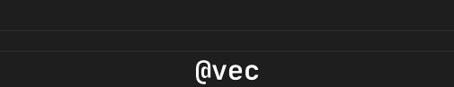
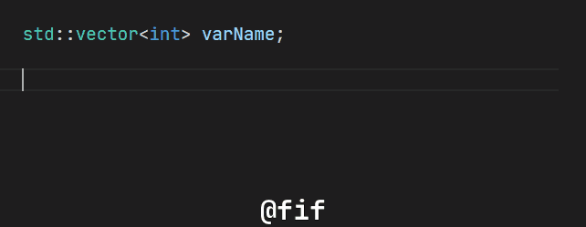
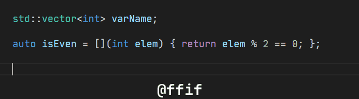

# VSC Ultimate C++ Snippets

An ultimate collection of C++ snippets for [VS Code](https://code.visualstudio.com).

[**Installation**](#-installation) | [**Snippet list**](#snippet-list) | [**Contributing**](#-contributing) | [**Presentation**](#-presentation) 
## 😄 Overview




... and many, many more.

## ⬇ Installation

1. Install [this VS Code extension](https://marketplace.visualstudio.com/items?itemName=draivin.hsnips)
2. Put [cpp.hsnips](snippets/cpp.hsnips) file into one of the following folders:
   - Windows: `%APPDATA%\Code\User\hsnips\`
   - Linux: `$HOME/.config/Code/User/hsnips/`
   - Mac: `$HOME/Library/Application Support/Code/User/hsnips/`

Done, optionally run action **Reload snippets**, or reopen editor.

## Snippet list:
- `@vec` -> `std::vector`
- **TODO**: more helper snippets
- `@fif` -> [`std::find_if`](#stdfind_if-lambda) (lambda)
- `@ffif` -> [`std::find_if`](#stdfind_if-function) (function)
- `@find` -> [`std::find`](#stdfind) (value)
- `@anyof` -> [`std::any_of`](#stdany_of-lambda) (lambda)
- `@fanyof` -> [`std::any_of`](#stdany_of-function) (function)
- `@allof` -> [`std::all_of`](#stdall_of-lambda) (lambda)
- `@fallof` -> [`std::all_of`](#stdall_of-function) (function)
- `@noneof` -> [`std::none_of`](#stdnone_of-lambda) (lambda)
- `@fnoneof` -> [`std::none_of`](#stdnone_of-function) (function)
- `@each` -> [`std::for_each`](#stdfor_each-lambda) (lambda)
- `@feach` -> [`std::for_each`](#stdfor_each-function) (function)
- `@neach` -> [`std::for_each_n`](#stdfor_each_n-lambda) (lambda)
- `@fneach` -> [`std::for_each_n`](#stdfor_each_n-function) (function)
- `@cif` -> [`std::count_if`](#stdcount_if-lambda) (lambda)
- `@fcif` -> [`std::count_if`](#stdcount_if-function) (function)
- `@count` -> [`std::count`](#stdcount-value) (value)
- `@=>` -> Lambda returning element
- **TODO**: entire algorithm library

## ⛑ Contributing

Feel free to put pull request, modifying [cpp.hsnips](snippets/cpp.hsnips)
We all will benefit from this.

## 🖼 Presentation:


### Vector definition

```cpp
varName@vec
```


### Standard `<algorithm>`


#### `std::find_if` (lambda)

```cpp
someRange@fif
```



#### `std::find_if` (function)

```cpp
someRange@ffif
```




